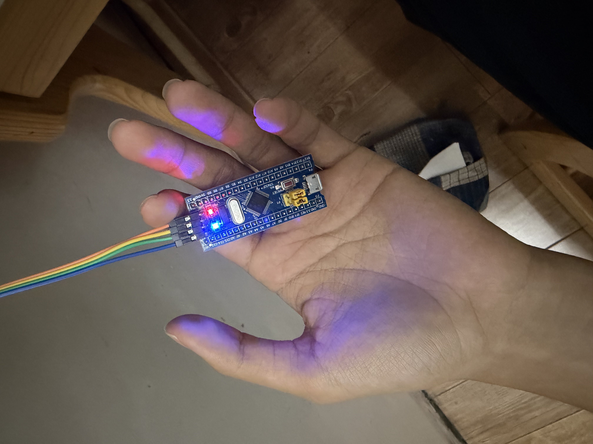
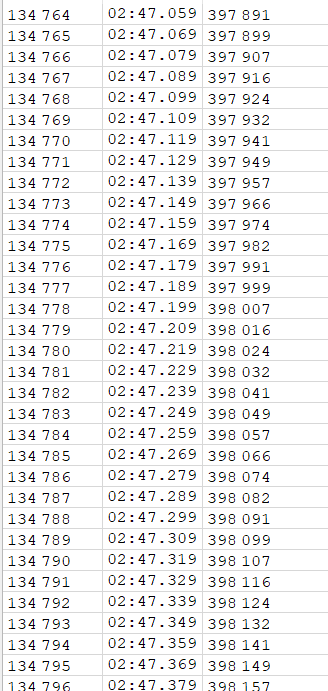
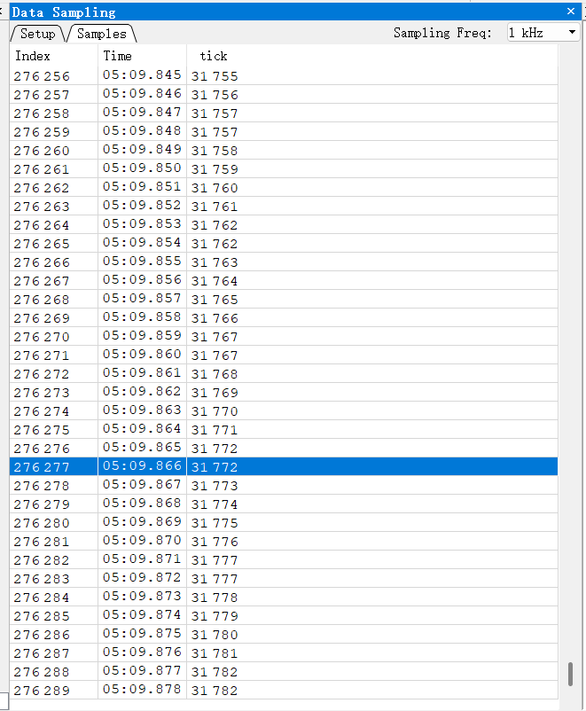

# 电控第一次作业 · 说明文档

| 项 | 内容 |
|---|---|
| 姓名 | 陈恩牧 |
| 学号 | 3260100694 |
| 日期 | 2026-10-04 |
| 工程 | `HW1`（STM32F103C8T6 最小系统板 + 克隆 J-Link） |
| 仓库 | https://github.com/Deplo-EM/RM-HW1-F103 |

> 说明：按老师要求，**正文不放任何截图/照片，所有图片统一放在最后的附录**，正文只写"见图 X"。

---

## 0. 三题总览

| 题 | 做什么 | 预期现象 | 对应附录 |
|---|---|---|---|
| 第 1 题 | PC13 输出低电平，点亮板载 LED | 板载灯**常亮** | 图① |
| 第 2 题 | TIM2 更新中断，周期 **1 ms**，中断里 `tick++` 并喂狗 | `tick` 每秒增加约 **1000** | 图② |
| 第 3 题 | 删掉喂狗，其余不动 | `tick` 涨到约 **2000** → 芯片复位 → `tick` 归零，反复 | 图③ |

---

## 1. 工程结构（为什么业务代码都在 `Tasks` 里）

| 目录/文件 | 谁生成的 | 说明 |
|---|---|---|
| `Core/`、`Drivers/` | CubeMX 生成 | 芯片启动、外设初始化、HAL 库 |
| **`Tasks/inc`、`Tasks/src`** | **我自己写** | **业务代码只在这里**（`Tasks.h` / `Tasks.cpp`） |
| `CMakeLists.txt` | 老师发的模板 | `set(user_folders "Tasks")`，只把 `Tasks` 目录当作"用户代码" |
| `main.c` | CubeMX 生成 | **只在 `USER CODE` 区域改动**：包含 `Tasks.h`、调用 `TasksInit()`，`while (1)` 保持为空 |

**为什么要把业务代码隔离在 `Tasks` 里**：
CubeMX 重新生成代码时，`Core/` 与 `Drivers/` 里的内容会被覆盖，而 `USER CODE BEGIN/END` 之间的内容会被保留。把业务代码放进独立的 `Tasks` 目录并由老师模板单独编译，就不怕重新生成时把代码冲掉，也方便老师只看一个文件夹就能看懂我写了什么。

---

## 2. 第 1 题：GPIO 点亮板载 LED

### 2.1 CubeMX 配置

| 项 | 值 |
|---|---|
| 引脚 | `PC13` → `GPIO_Output`，标签 `LED` |
| 输出模式 | 推挽输出（Push Pull），无上下拉 |
| 速度 | Low |

### 2.2 代码（`Tasks/src/Tasks.cpp` 的 `TasksInit()`）

```cpp
void TasksInit(void)
{
    /* 第 1 题：把 PC13 拉低 —— 低电平点亮板载 LED */
    HAL_GPIO_WritePin(LED_GPIO_Port, LED_Pin, GPIO_PIN_RESET);
}
```

- `LED_GPIO_Port` / `LED_Pin` 是 CubeMX 根据标签 `LED` 自动生成的宏（分别等于 `GPIOC` 和 `GPIO_PIN_13`）；
- `GPIO_PIN_RESET` 表示**输出低电平**（0 V）。

### 2.3 为什么"低电平"反而点亮

板载 LED 的接法是：**3.3 V → 限流电阻 → LED → PC13**。
所以 PC13 输出**低电平**时，电流从 3.3 V 经电阻、LED 流进 PC13，形成回路 → **灯亮**；输出高电平时两端都是 3.3 V，没有电流 → 灯灭。这叫"**低电平有效**（低有效）"。

### 2.4 现象

板载蓝灯**常亮**（对比：出厂程序是闪烁的）→ **见图①**。

> 补充：这一题按要求**还没有喂狗**，所以芯片会每约 2 秒被 IWDG 复位一次。复位瞬间 LED 会短暂熄灭再重新点亮，因为时间极短（几毫秒），肉眼几乎看不出来 —— 这是预期现象，不是故障。

---

## 3. 第 2 题：TIM 更新中断，周期 1 ms

### 3.1 关键：1 ms 是算出来的（定时器时钟从哪来）

**第一步：系统时钟 72 MHz 是怎么来的**

| 环节 | 设置 | 结果 |
|---|---|---|
| 外部晶振 HSE | 板上 8 MHz 晶振 | 8 MHz |
| PLL | 倍频 ×9 | **SYSCLK = 8 × 9 = 72 MHz** |
| AHB 预分频 | ÷1 | HCLK = 72 MHz |
| APB1 预分频 | ÷2 | PCLK1 = 36 MHz |
| APB2 预分频 | ÷1 | PCLK2 = 72 MHz |

**第二步：定时器时钟为什么是 72 MHz 而不是 36 MHz**

这是最容易算错的一步：STM32 规定 —— **当 APB 预分频系数不为 1 时，挂在它下面的定时器时钟会自动 ×2**。
所以：`定时器时钟 = PCLK1 × 2 = 36 × 2 = 72 MHz`。

（这一步在 CubeMX 里也能直接看到：时钟树页面的 `APB1 Timer clocks` 显示 `72 MHz`，`.ioc` 文件里是 `RCC.APB1TimFreq_Value=72000000`。）

**第三步：用 PSC / ARR 凑出 1 ms**

定时器更新频率公式：

```
f_update = 定时器时钟 / ((PSC + 1) × (ARR + 1))
```

代入我配置的值 `PSC = 71`、`ARR = 999`：

```
计数器时钟 = 72 MHz / (71 + 1)  = 1 MHz      ← 计数器每 1 µs 加 1
f_update   = 1 MHz  / (999 + 1) = 1 kHz      ← 每 1000 个计数溢出一次
T_update   = 1 / 1 kHz          = 1 ms       ✅
```

所以：**每 1 ms 产生一次更新中断**，中断里让 `tick` 加一，`tick` 就成了一只"毫秒表"。

### 3.2 代码

**（1）启动定时器**（`TasksInit()` 里）

```cpp
    HAL_TIM_Base_Start_IT(&htim2);   /* 启动 TIM2 的更新中断 */
```

为什么必须自己写这一行：CubeMX 生成的 `MX_TIM2_Init()` 只做了**配置**（设置 PSC/ARR、把中断向量挂进 NVIC），**并没有启动计数**。

> 类比：水管接好了（配置完成），但总阀门没开（没启动）→ 一滴水都不会流。

**（2）中断回调**（`Tasks.cpp`）

```cpp
extern "C" void HAL_TIM_PeriodElapsedCallback(TIM_HandleTypeDef *htim)
{
    if (htim->Instance == TIM2)          /* 确认这次中断来自 TIM2 */
    {
        tick++;                           /* 每 1 ms 加 1 */
        HAL_IWDG_Refresh(&hiwdg);         /* 喂狗（第 3 题会删掉这行） */
    }
}
```

**逐点解释**：

| 写法 | 为什么必须这样 |
|---|---|
| `extern "C"` | 这是 C++ 文件，而 HAL 库是 C 写的。不加 `extern "C"`，C++ 会把函数名"改名"（mangling）成 `_Z...`，链接时 HAL 找不到这个名字 → **编译能过，但中断永远不会进你的函数**（最隐蔽的坑） |
| 函数名 `HAL_TIM_PeriodElapsedCallback` | HAL 里已有一个同名的**弱符号**空实现；我写一个同名的强符号，链接时就会**覆盖**它，HAL 的中断处理流程就会调用到我的版本 |
| `if (htim->Instance == TIM2)` | 这个回调是**所有定时器共用**的；判断 `Instance` 才知道这次是谁触发的（以后加别的定时器时不会互相干扰） |
| `tick++` | `tick` 定义为全局 `volatile uint32_t`（见下） |
| `HAL_IWDG_Refresh(&hiwdg)` | 喂狗（第 2 题需要；第 3 题删掉） |

**（3）`tick` 的定义**

```cpp
volatile uint32_t tick = 0;   /* 每 1 ms 自增 1 的毫秒计数器 */
```

`volatile` 的作用：告诉编译器"这个变量可能被中断随时改掉，每次用都要真的去内存里读，不许缓存到寄存器里"。不加 `volatile`，编译器在优化时可能把它读进寄存器只读一次，导致调试器/主循环看到的值永远不变。

### 3.3 现象与验证

| 验证方式 | 结果 |
|---|---|
| Ozone 后台采样 `tick`（`Data Sampling`，不停 CPU） | `tick` 随时间**单调增长** → **见图②** |
| 用**独立时钟**核对速率 | 主机计时 **30.214 秒**，`tick` 从 **22952** 涨到 **53143**（+30191）→ **999.2 /秒** ✅ |

**为什么要用"独立时钟"再核一遍**（这段是我这次作业最大的收获）：
Ozone 的 `Data Sampling` 窗口带一列 `Time`。按它的时间列去算，会得到约 **831/秒**，和理论值 1000 差 17%。为了判断"到底是芯片慢了，还是软件的时间列不准"，我用**电脑的时钟**（与芯片完全独立的第二个时钟）直接读 `tick` 的起止值来算：

| 次 | 主机时钟时刻 | `tick` |
|---|---|---|
| A | 06:28:13.661 | 22952 |
| B | 06:28:43.875 | 53143 |

`30191 ÷ 30.214 = 999.2 /秒` → **芯片侧的 1 ms 是准的**，偏差来自 Ozone 采样窗口自己的时间列。
**经验**：任何一个时钟，在被第二个独立时钟验证之前都不能全信；交叉验证才能定位到底是谁不准。

---

## 4. 第 3 题：看门狗（IWDG）

### 4.1 2 秒是怎么来的

IWDG 的时钟是芯片内部的 **LSI**（低速内部 RC 振荡器），STM32F103 手册给的典型值是 **40 kHz**（C 板 / A 板是 32 kHz）。

| 环节 | 设置 | 结果 |
|---|---|---|
| LSI | 40 kHz（典型值） | 40 000 Hz |
| IWDG 预分频 | 64 | 40000 / 64 = **625 Hz** |
| Reload | 1249 | 从 1249 倒数到 0，共 **1250** 个计数 |

```
超时时间 = 1250 / 625 = 2.000 秒     ✅ 明显长于 1 ms 的中断周期
```

> 注意：LSI 是内部 RC 振荡器，精度较差（可能偏差几成），所以实测超时通常在 1.5~2.5 秒之间，这是正常的；题目要求的"约 2 秒"指的是按手册典型值算出来的 2.000 秒。

### 4.2 改动（只删一行）

```cpp
        tick++;                           /* 不动 */
        // HAL_IWDG_Refresh(&hiwdg);      /* 第 3 题：去掉喂狗 */
```

其余代码（PSC/ARR、IWDG 的分频与 Reload、`tick` 的逻辑）**全部不动**。

### 4.3 现象与验证

- 预期：`tick` 从 0 涨到约 **2000**（= 约 2 秒 × 1000/秒）→ 看门狗超时 → 芯片复位 → `tick` 归零 → 再涨……
- **实测**（截图里的原始数据）：`tick` 涨到 **2048** 时归零，随后从 0 重新开始计数 —— 与"约 2 秒 × 1000/秒"吻合 ✅
- **见图③**（Ozone 连续采样截图，能看到涨上去再归零）。

**观察时的坑（老师也特别提醒过）**：CPU 被暂停（打断点 / `Halt`）时，**IWDG 仍在继续计数** —— 因为它由独立的 LSI 驱动，不依赖 CPU。所以一旦暂停超过约 2 秒，芯片就被复位、调试器直接掉线。因此第 3 题**必须用"不暂停 CPU"的方式观察**（我用的是 Ozone 的 `Data Sampling`，它在后台读内存，不停 CPU）。

### 4.4 编译结果核对（确认喂狗真的被删掉了）

用 `arm-none-eabi-objdump` 反汇编最终固件，中断回调里已经**没有**对 `HAL_IWDG_Refresh` 的调用：

```asm
08001b1c <HAL_TIM_PeriodElapsedCallback>:
 8001b22:  str   r0, [r7, #4]
 8001b26:  ldr   r3, [r3, #0]                      @ htim->Instance
 8001b28:  cmp.w r3, #1073741824   @ 0x40000000    @ == TIM2 ?
 8001b2c:  bne.n 8001b38                           @ 不是就跳过
 8001b30:  ldr   r3, [r3]                          @ 读 tick
 8001b32:  adds  r3, #1                            @ tick + 1
 8001b36:  str   r3, [r2]                          @ 写回
 8001b40:  bx    lr                                @ 返回（没有 bl HAL_IWDG_Refresh）
```

---

## 5. 过程中遇到的问题与解决（记录）

| # | 问题 | 原因 | 解决 |
|---|---|---|---|
| 1 | J-Link 报 `Cannot connect to the probe/programmer` | 这只克隆 J-Link 在**部分 USB 口**上驱动绑定不正常 | 换到另一个 USB 口即可（认准能用的那个口，之后固定使用） |
| 2 | 刚开机后第一次连接必然失败 | USB 设备/驱动还没就绪 | 开机后等约 10 秒再连 |
| 3 | 烧录报 `Communication timed out` / `Failed to preserve target RAM` / `Target voltage too low (0.0 V)` | **Ozone 还开着**，两个程序同时抢同一只 J-Link | 烧录前**完全退出 Ozone**（含托盘里的 `JLinkGUIServer`）。"电压 0 V"是通信被打断后的误报 |
| 4 | 第 1 题烧录偶尔失败 | 这一题不喂狗，芯片每 2 秒复位一次；烧录耗时超过 2 秒就会被打断 | 重跑一次烧录脚本（通常第二次就过）；必要时先让上一次复位结束 |
| 5 | Ozone 的 `Watched Data` 在程序运行时数值不动 | 它是"停下读一次"的机制，运行时不刷新 | 要看"随时间变化"改用 `Data Sampling`（后台采样，不停 CPU） |
| 6 | 按 Data Sampling 的时间列算，速率只有 831/秒 | Ozone 该窗口的时间戳比真实时间短约 18%（两种采样率下偏差一致） | 用**独立时钟**（电脑计时）核对，得到 999.2/秒，确认芯片正确 |
| 7 | `PC13` 的灯"不闪"，以为程序没跑 | 程序确实在跑（`tick` 在增长），只是题目要求的是**常亮**而非闪烁 | 用"红灯常亮=有电、蓝灯常亮=程序拉低 PC13"来区分两个灯的含义 |

---

## 6. 对本次作业/培训的建议

1. **建议在题面里提示"克隆 J-Link 可能挑 USB 口"**：这次卡了很久，现象是软件报 `Cannot connect to the probe/programmer`，但设备管理器里能看到设备、驱动也装好了。换一个 USB 口就好了 —— 这类"环境坑"如果能提前给一句话，能省很多时间。
2. **建议明确"观察看门狗现象禁止暂停 CPU"的原因**：题面已经提醒了，如果补一句"因为 IWDG 由独立的 LSI 驱动，CPU 停住它照数"，理解会更到位（我这次是靠推理和掉线才确认的）。
3. **建议给一个 Ozone 的推荐版本与最小操作步骤**（例如：用什么版本、看变量用哪个窗口）。Ozone 各版本菜单名不一样，`Watched Data` 又不支持运行时刷新，新手很容易以为"程序没跑"。
4. **关于说明文档格式**：题面没有规定格式，我提交的是 Markdown（也可导出 PDF）。如果老师有偏好（Word / PDF），下次可以直接按统一格式交。

---

## 附录（所有图片只在此处出现）

### 图① 第 1 题：GPIO 低电平点亮板载 LED

（照片：板载蓝灯常亮）



### 图② 第 2 题：`tick` 随时间增长（Ozone Data Sampling）

（Ozone 后台采样，程序处于**运行**状态；`Time` 列仅供参考，速率的准确核对见 3.3 节的独立时钟测量）



### 图③ 第 3 题：`tick` 涨到约 2000 后归零（看门狗复位）

（Ozone `Data Sampling` 连续采样；每约 2 秒出现一次"涨到约 2000 → 归零"的锯齿）



---

## 附：如何复现（构建与烧录）

```powershell
# 1. 编译（VS Code 里选 Debug 构建类型，或命令行）
cd D:\ForTest\HW1
cmake --build --preset Debug

# 2. 烧录（Ozone 必须先完全退出，否则会抢 J-Link）
& 'C:\Program Files\SEGGER\JLink_V980\JLink.exe' -NoGui 1 -CommanderScript 'D:\ForTest\HW1\tools\jlink_flash.jlink'

# 3. 观察：用 Ozone 打开 build\HW1.elf
```

| 外设配置一览 | 值 |
|---|---|
| SYSCLK | 72 MHz（HSE 8 MHz ×9） |
| TIM2 | PSC = 71，ARR = 999 → 更新中断 1 kHz（1 ms） |
| IWDG | 预分频 64，Reload 1249 → 超时 2.000 s（LSI 40 kHz） |
| LED | PC13，推挽输出，低电平点亮 |
